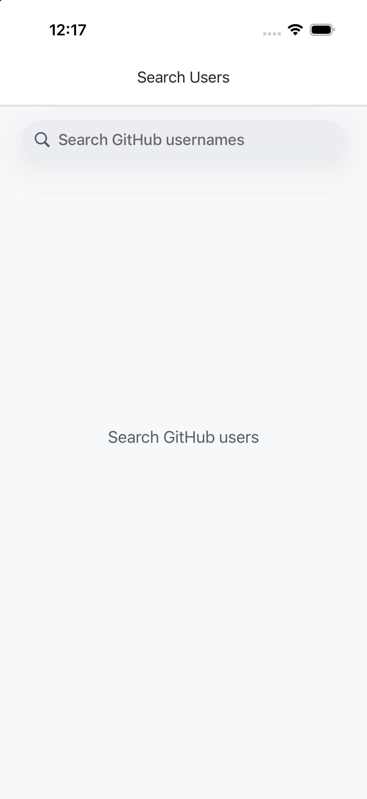
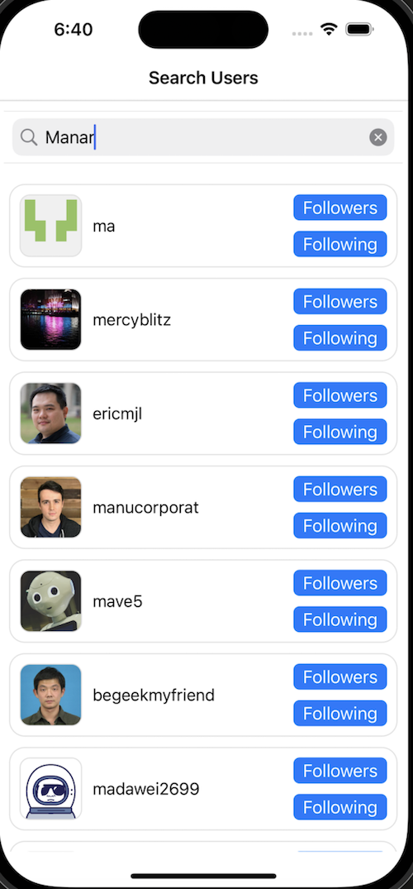

# GitHub Users

An iOS UIKit app for searching GitHub users and browsing their followers or following lists. The project uses a lightweight MVVM structure with RxSwift bindings, Alamofire networking, Kingfisher image loading, and XIB-based UIKit screens.

## Screenshots

<p>
  
  
  
  
</p>

## Features

- Search GitHub users through the public GitHub REST API.
- Browse followers and following lists for any result.
- Debounced search input to avoid unnecessary API calls.
- Paginated loading for search and follow lists.
- Reusable UIKit cell and button components.
- Light/dark-mode-ready semantic color system.
- Cleaner empty, loading, and no-results states.

## Tech Stack

- UIKit and XIBs
- MVVM
- RxSwift and RxCocoa
- Alamofire
- Kingfisher
- Lottie
- CocoaPods

## Requirements

- Xcode 15 or newer
- iOS 13.0+
- CocoaPods

## Setup

```bash
git clone https://github.com/YasserGh96/github-users.git
cd github-users
pod install
open "GitHub Users.xcworkspace"
```

Build and run the `GitHub Users` scheme.

## API

The app uses the public GitHub REST API and does not require an API key. Unauthenticated requests are rate-limited by GitHub, so heavy testing may temporarily return rate-limit errors.

## Notes

This project intentionally highlights UIKit fundamentals: programmatic view controller setup, reusable XIB components, Rx-based binding, and clean networking boundaries.
