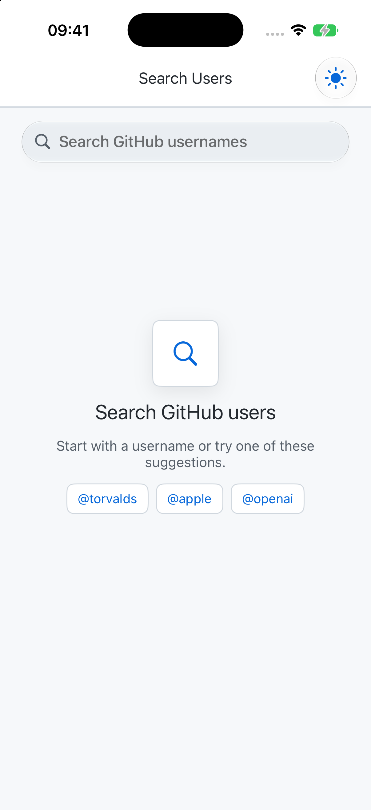
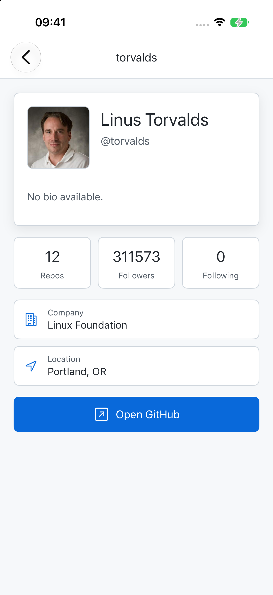
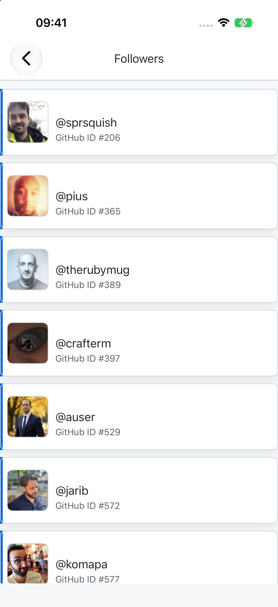
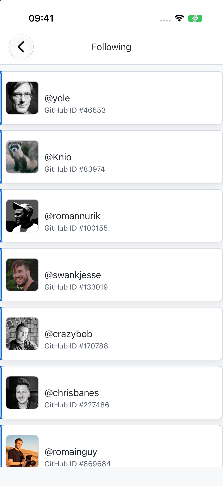

# GitHub Users

GitHub Users is a UIKit iOS app for searching GitHub accounts, browsing followers and following lists, and opening a detailed GitHub profile view.

The project is built as a portfolio-friendly UIKit codebase: XIB-based screens, MVVM-style view models, RxSwift bindings, Alamofire networking, Kingfisher image loading, pagination, pull-to-refresh, reusable UI components, and light/dark theme support.

## Screenshots

| Search | Profile | Followers | Following |
| --- | --- | --- | --- |
|  |  |  |  |

## Features

- Search GitHub users through the public GitHub REST API.
- Open a detailed profile screen with avatar, name, bio, repos, followers, following, company, location, website, and GitHub profile link.
- Browse followers and following lists for any user.
- Pull to refresh on search results, followers, and following screens.
- Debounced search input to reduce unnecessary API requests.
- Paginated loading for search and follow lists.
- System, light, and dark appearance modes with persisted theme selection.
- Reusable UIKit table cell, button, spinner, navigation, and styling helpers.
- Polished empty, loading, no-results, and error states.
- Scene lifecycle support for modern iOS SDKs.

## Tech Stack

- UIKit with XIB-based screens
- MVVM-style view models
- RxSwift, RxCocoa, and RxDataSources
- Alamofire
- Kingfisher
- Lottie
- CocoaPods

## Architecture

The app keeps the main responsibilities separated:

- `Network`: GitHub API endpoints, request handling, result parsing, and error mapping.
- `UserSearch`: search screen, search result model, reusable user card cell, and search view model.
- `UserFollows`: followers/following list screen and pagination state.
- `UserProfile`: profile model, profile API loading, and detail screen.
- `Utilities`: app strings, colors, fonts, images, logging, and theme management.
- `Helpers`: base view controllers, reusable views, extensions, alerts, and table cell helpers.

The view models expose UI state through Rx `Driver`s so view controllers can bind loading, refresh, table visibility, empty states, and data updates in a predictable way.

## API

The app uses the public GitHub REST API:

- `GET /search/users`
- `GET /users/{username}`
- `GET /users/{username}/followers`
- `GET /users/{username}/following`

No API key is required. GitHub rate-limits unauthenticated requests, so heavy testing may temporarily return rate-limit errors.

## Requirements

- Xcode 15 or newer
- iOS 15.0 or newer
- CocoaPods

## Setup

```bash
git clone https://github.com/YasserGh96/github-users.git
cd github-users
pod install
open "GitHub Users.xcworkspace"
```

Build and run the `GitHub Users` scheme from the workspace.

## Portfolio Notes

This project is meant to demonstrate practical UIKit maintenance and modernization: cleaning an older UIKit app, improving RxSwift usage, moving repeated UI copy into constants, fixing modern scene lifecycle requirements, adding theme support, and extending the app with real API-backed profile details.
